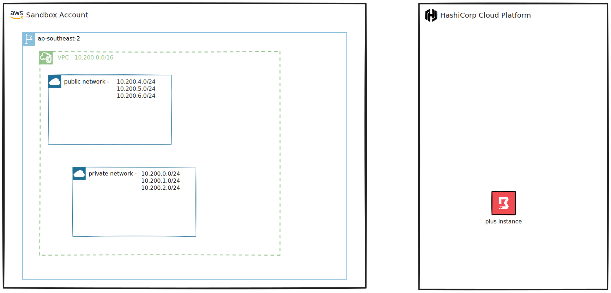

<h1>
  
  <span>The Sandpit</span>
</h1>

# Overview

The sandpit is a self-contained deployable environment that assumes no existing cloud infrastructure.

Once deployed, the sandpit will provide an environment that can be customised and used for debugging, testing and demonstrating HCP Boundary.

Deployable patterns can be layered on top to demonstrate different scenarios and use cases.

# Architecture

The environment predominantly uses HashiCorp Cloud Platform (HCP) services with Amazon Web Services (AWS).

## High-level Diagram



## Infrastructure Components

The terraform module deploys ~106 resources. The major components include:

**HCP**
- HCP Boundary Cluster

**AWS**
- Virtual Private Cloud (VPC), associated subnets, route tables, and gateways
- Security Groups
- Key Pair
- Elastic Compute Cloud (EC2) instance (bastion host)

# Prerequisites

The environment assumes you have an active HashiCorp Cloud Platform (HCP) and Amazon Web Services (AWS) subscriptions with the necessary privileges to deploy the required infrastructure components. Review the following instructions to ensure you meet the requirements for this module to deploy successfully:

**1. HCP**

- Create an HCP account. For more information, visit the [*Create an HCP Account*](https://developer.hashicorp.com/hcp/docs/hcp/create-account) page.
- Obtain the `hcp_client_id` and `hcp_client_secret` by creating a Service Principle and associated Service Principal Key. For detailed steps, visit the [*Create a Service Principle*](https://developer.hashicorp.com/hcp/docs/hcp/security/service-principals) page.

The Terraform HCP Provider authenticates via a Client ID and a Client Secret.

**2. AWS**

- Create an AWS account. For more information, visit the [*Create and Activate an AWS Account*](https://aws.amazon.com/premiumsupport/knowledge-center/create-and-activate-aws-account) page.
- Install the AWS Command Line Interface (AWS CLI). For detailed steps, visit the [*Installing or upgrading the AWS CLI*](https://docs.aws.amazon.com/cli/latest/userguide/getting-started-install.html) page.
- Configure the AWS CLI. For detailed steps, visit the [*Configuration basics*](https://docs.aws.amazon.com/cli/latest/userguide/cli-configure-quickstart.html#cli-configure-quickstart-creds) page.

The Terraform AWS Provider authenticates via the AWS CLI rather than directly providing the `access_key` and `secret_key` in the provider configuration.

# Usage

1. Execute `git clone https://github.com/phan-t/terraform-hcp-boundary-vault-amp.git`
2. Rename `terraform.tfvars.example` to `terraform.tfvars` in the root directory or alternative create a new `terraform.tfvars`
3. Add required input values to `terraform.tfvars`
   
   Example `terraform.tfvars`:
   ```hcl
    deployment_name = "test"
    hcp_client_id = ""
    hcp_client_secret = ""
    aws_region = "ap-southeast-2"
    boundary_init_pass = "HashiCorp1!"
   ```
4. Run `terraform init`
5. Run `terraform plan`
6. Run `terraform apply`

## Post Deployment

- AWS key pair pem file is created in the root directory

# Deployable patterns

- [multi-hop](./examples/patterns/multi-hop/)

## Clean-Up

1. Run `terraform destroy`